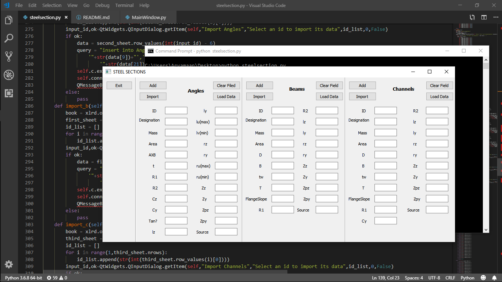

# Steel Section Application
### Desktop Application for displayig the properties of Steel Sections

This project builds a desktop application built using PyQt5 which is a Python binding of the cross-platform GUI toolkit.The application inputs data from a database as well as from a excel sheet.It displays all the properties of a user selected steel section.It can also add properties of a steel section into the database by inputting its details in the respective fields.

## Installation

Use the package manager [pip](https://pip.pypa.io/en/stable/) to install PyQt5,xlrd and sqlite3.

```bash
pip install pyqt5
pip install xlrd
pip install pysqlite3 
```

## How to open the application ?
Clone the repository first then open the directory and type in the following command in your Terminal.

```bash
python steelsection.py
```

## Demo
Here is a demo what Project look like once it's set up.

<p align="left" markdown="1">
  
</p>

## About the files 

  **/**
    &emsp; &emsp; `MainWindow.ui`: UI file
    &emsp; &emsp; `MainWindow.py`: UI python file 
    &emsp; &emsp; `steelsection.py`: Contains all the functionalities 
  **img/**
      Images of application

## How does this work ? 

1. **Load Data:** Asks the user to select the designation and displays its properties.
2. **Clear Field:** Clear the fields so we can type in new entries.
3. **Add:** Adds the properties of steel section into the database by fetching the data from input fields.
4. **Import:** Asks the user to select the designation of the steel section of which he/she wants to import data from excel file.The user can                  then view the imported data by clicking on the Load Data button and selecting its designation.
5. **Exit:** Exits the application.

## License
[MIT](https://choosealicense.com/licenses/mit/)
